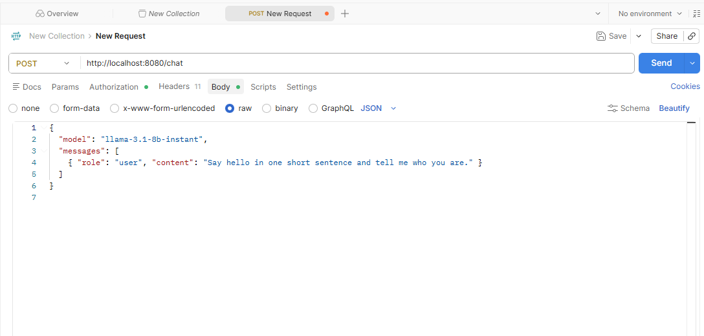
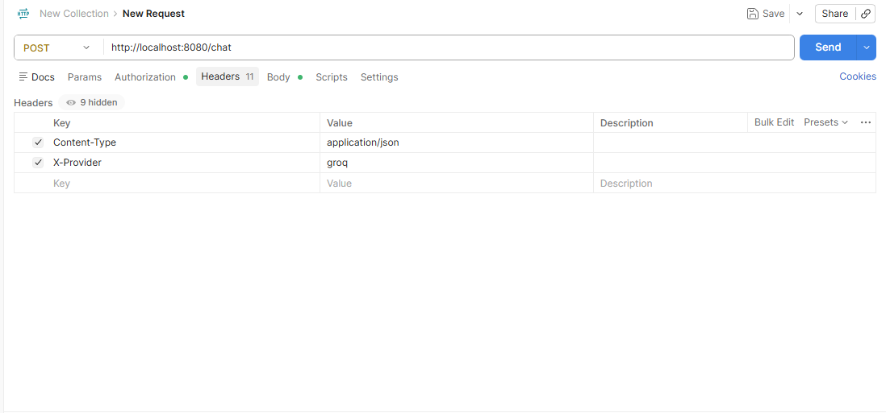
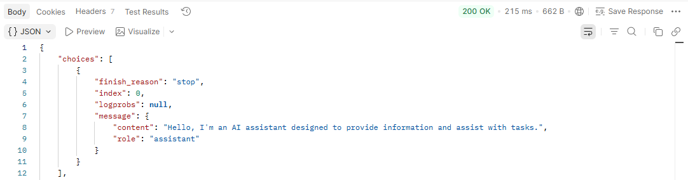
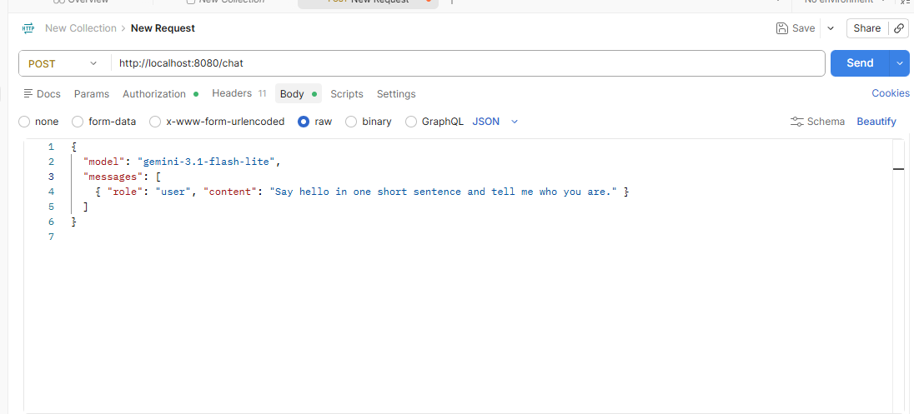
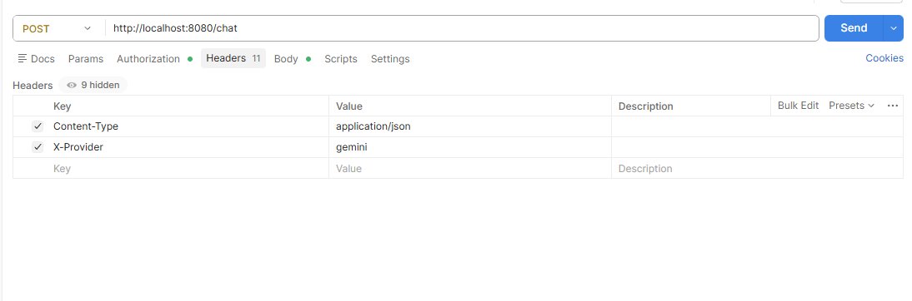

# KrakenD Adoption Guide

Research and hands-on materials for evaluating KrakenD as our API gateway, including a
comparison against WSO2 and a working AI Gateway demo.

## Contents

- **[`docs/`](docs/)** — the KrakenD vs WSO2 comparison, split into one chapter per topic
  (start at [`docs/00-framing.md`](docs/00-framing.md) or jump straight to
  [`docs/07-summary-recommendation.md`](docs/07-summary-recommendation.md) for the
  short version).
- **[`ai-gateway-demo/`](ai-gateway-demo/)** — a minimal, working KrakenD Enterprise AI
  Gateway, proxying to Groq and Gemini, used to get hands-on experience with the feature
  discussed in [`docs/04-ai-gateway.md`](docs/04-ai-gateway.md).

## AI Gateway Demo — Quick Overview

A single KrakenD endpoint (`POST /chat`) that routes to either **Groq** or **Gemini**
based on an `X-Provider` request header, without the client ever holding either
provider's API key.

**Run it:**
```
cd ai-gateway-demo
docker-compose up -d
```

**Test it (Postman or curl):** `POST http://localhost:8080/chat`

| Provider | `X-Provider` header | `model` in body |
|---|---|---|
| Groq | `groq` | `llama-3.1-8b-instant` |
| Gemini | `gemini` | `gemini-3.1-flash-lite` |

### Groq request/response

Body:


Headers:


Response:


### Gemini request

Body:


Headers:


## How the Config Works (`krakend.json`)

The whole demo is one config file. It creates a single door — `POST /chat` — that
forwards your message to either Groq or Gemini, secretly attaching the right API key on
the way out.

- **`"endpoint": "/chat"`** — the single URL clients call.
- **`"input_headers": ["X-Provider"]`** — tells KrakenD to read the `X-Provider` header
  the client sends (otherwise it would be ignored).
- **Two `backend` entries** — one pointing at Groq, one at Gemini.
- **`"backend/conditional"`** — the switch. Each backend only runs if `X-Provider`
  matches its value (`groq` or `gemini`). This is what lets one endpoint route to two
  different providers.
- **`"modifier/martian"`** — the key injector. Before the request leaves KrakenD, it adds
  an `Authorization: Bearer <key>` header, pulling the key from the `.env` file
  (`{{ env "GROQ_API_KEY" }}`). The client never provides or sees the key.

## What This Demo Shows

- **The client never holds an API key** — KrakenD injects the right `Authorization`
  header per provider via `modifier/martian`.
- **Routing between LLM providers** — one endpoint, two backends, selected purely by the
  `X-Provider` request header via `backend/conditional`.
